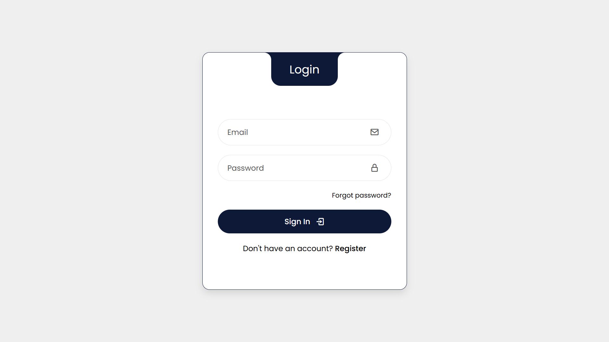
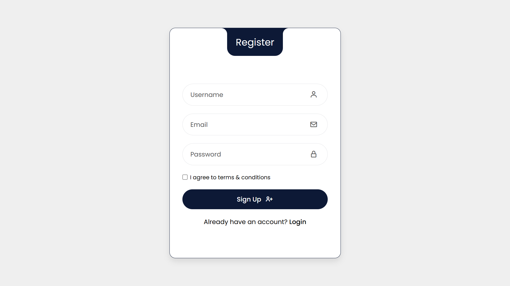

# 🔐 Login & Registration Page

A modern and responsive **Login & Registration UI** built with **HTML & CSS**. This project focuses on clean layout, responsive design, and user-friendly interface.

## 🌐 Live Demo  
👉 [Click Here to View](https://manish6862.github.io/login-page/)

---

## ✨ Features

- Fully responsive layout  
- Login & Sign-Up forms  
- Clean UI with modern design  
- Styled input fields and buttons  
- Hover effects and link styling

---

## 🛠️ Technologies Used

- HTML5  
- CSS3  
- Google Fonts  
- Font Awesome (for icons)

---

## 📸 Screenshots

### 🔑 Login Page

### 📝 Registration Page

---

## 📚 What I Learned

- Creating form layouts using HTML  
- Styling with CSS for a clean user experience  
- Implementing responsive design

---

## 📌 Note

This is a **static front-end project** built for learning purposes. No backend or database functionality is included.

---

